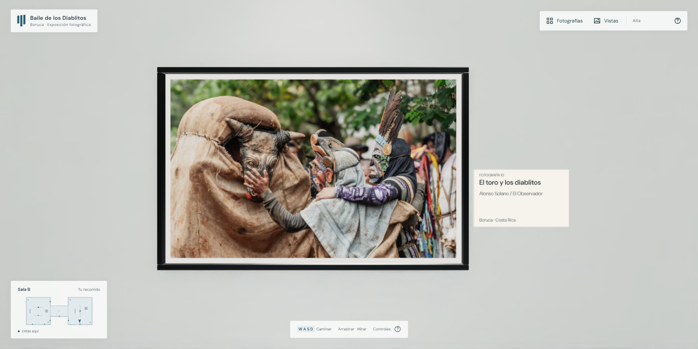
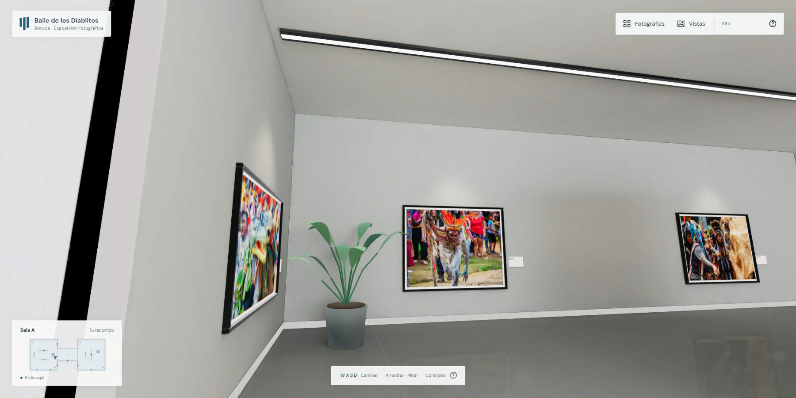
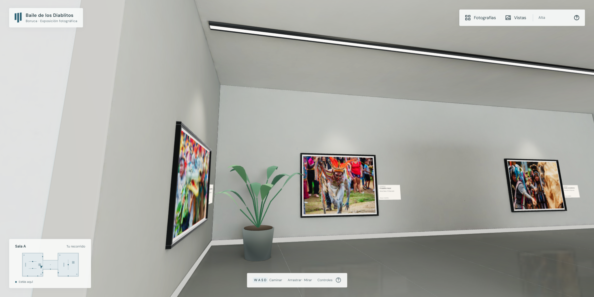

# Cartelas legibles y unión de las entradas

Actualización del 7 de octubre de 2026.

Las 12 cartelas físicas ahora miden 80 × 48 cm, frente a 40 × 25 cm. Usan DM Sans, título destacado, número de fotografía, crédito completo y ubicación. La superficie marfil y el texto oscuro conservan su contraste con la iluminación de la sala. Cada textura se genera una sola vez a 1200 × 720, con mipmaps y filtrado anisotrópico; las letras pequeñas convertidas a geometría se ocultan. El texto se toma del catálogo y se envuelve por palabras, conservando acentos. Hacer clic en una cartela enfoca su fotografía y abre la ficha.

La franja negra de la entrada persistía porque dos superficies estaban superpuestas: el frente del pasillo y la tapa del muro de la sala. En la exportación, ambas pertenecen al mismo módulo y tenían la misma prioridad de profundidad. Un rayo en `x = −5,94`, `y = 2`, hacia `z` positivo encontraba dos caras prácticamente coincidentes en `z = 3,5`: material horneado y material de detalle. El mismo problema existía en el extremo opuesto.

La carga ahora recorta los extremos de las superficies largas del muro del pasillo hasta el encuentro con las paredes de las salas. Interpola posiciones, normales y coordenadas de textura, incluidas las del horneado. La tapa del muro queda como única superficie en cada extremo. Las columnas, el techo y los demás muros de esa malla no se recortan. El cambio se realiza una vez, antes de las capturas de iluminación y del índice de selección.

Antes:

Después, desde la misma posición y orientación:

Validación:

- 44 pruebas pasan, incluidas eliminación del solapamiento en ambos extremos, conservación de UVs, recorte en coordenadas del mundo y separación de las cartelas para cuatro orientaciones de pared.
- TypeScript y compilación de producción correctos.
- Verificación de producción en una pestaña nueva con `requestAnimationFrame` nativo: entrada, giro, desplazamiento y enfoque de las 12 fotografías, sin errores de página.
- Comprobación visual de las entradas desde ocho posiciones/orientaciones en las dos salas.
- Las 12 fotografías conservan una vista despejada de enfoque. Se comprobó el clic sobre la cartela de la fotografía 10 y el regreso al recorrido.
- Los 12 títulos y sus créditos caben en las texturas. El título más largo ocupa dos líneas.
- Se conservan las fotografías originales, el GLB, el Blender editable, la iluminación y las resoluciones de reflejos y sombras. No se recomprimieron los recursos.

Los ajustes de cartelas y unión de muros se aplican en la visita web. Las seis vistas ya renderizadas de Blender conservan la versión anterior de las cartelas.
