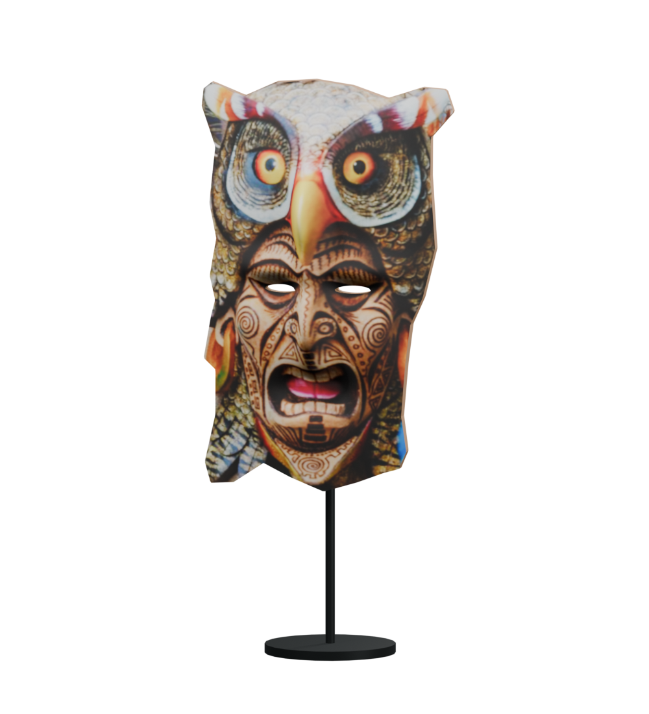
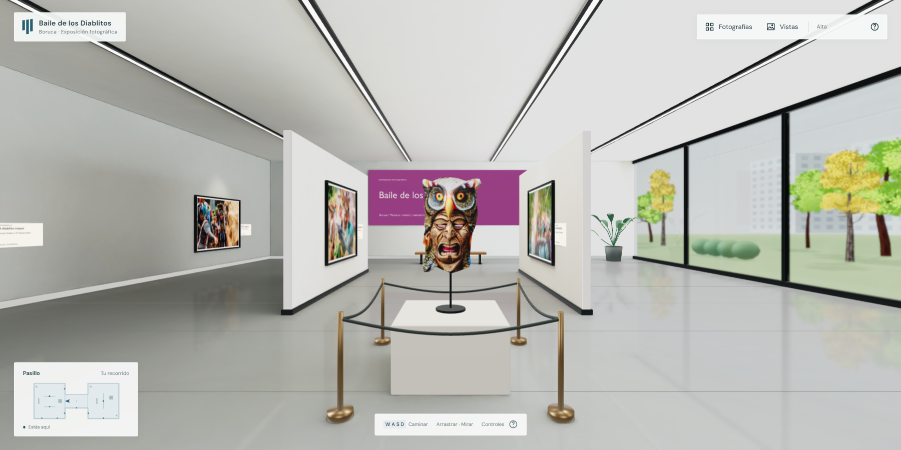
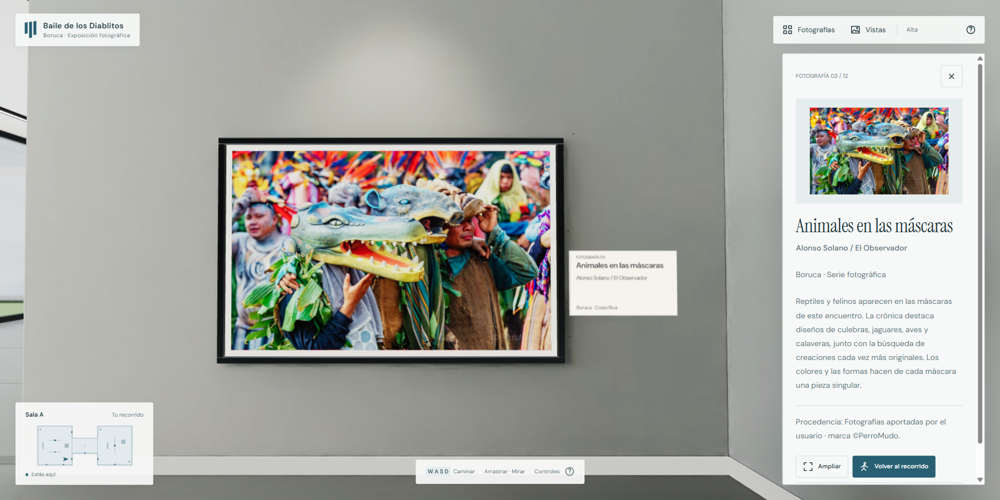

# Máscara de búho

El asset final utiliza la máscara de la fotografía elegida por el usuario. La propuesta generada de jaguar se descartó y no forma parte del proyecto.

La geometría se modeló en Blender como un relieve cerrado: silueta recortada, pico y nariz elevados, boca hundida, aberturas de ojos y parte posterior de madera. El color frontal utiliza la fotografía original, sin redibujar el rostro, cambiar los motivos o generar una nueva expresión. El volumen posterior es una aproximación de modelado a partir de una sola vista; no es un escaneo fotogramétrico completo. La corona de plumas del fondo de la fotografía no se incluye.

- Asset reutilizable: `public/models/boruca-owl-mask.glb`, 1 548 908 bytes, con textura incorporada y soporte de exposición.
- Fuente editable independiente: `gallery-source/blender/owl-mask.blend`.
- Referencia: `gallery-source/blender/owl-mask-reference.png`, 413 × 542 píxeles, aportada por el usuario. La resolución frontal está limitada por esta referencia.
- Relieve: 43 076 triángulos, 21 536 vértices, cero aristas no manifold. Mide aproximadamente 67 × 107 cm y tiene 22 cm de profundidad máxima; el conjunto incluye el soporte metálico.
- Scripts reproducibles: `build_owl_mask.py` e `install_owl_mask.py` en `gallery-source/blender/scripts`.

Las dos esculturas abstractas se sustituyen por copias del mismo asset que comparten geometría, textura y materiales. Conservan los pedestales y las barreras existentes; las máscaras miran hacia el recorrido. Se activan sus sombras y aparecen en los reflejos capturados en la carga de la sala.

Se retiró solamente la maceta `Decor_Planter_01`, con su tierra, tallos, hojas y obstáculo de navegación. Estaba junto a «Animales en las máscaras». Las otras tres plantas permanecen.

La galería editable `gallery-source/blender/gallery.blend` incorpora las dos máscaras y la retirada de la maceta. La web carga el nuevo asset por separado y reemplaza los objetos anteriores antes de calcular reflejos, límites de selección y transformaciones estáticas. El GLB arquitectónico conserva el horneado anterior; `export-report.json` describe aquella exportación, no este cambio de mobiliario. Las seis imágenes prerenderizadas mantienen su versión anterior hasta volver a renderizarlas desde el Blender actualizado.

Se mantienen fotografías, cartelas, enfoque y retorno al recorrido, iluminación, antialiasing, calidad alta por defecto y resoluciones de reflejos y sombras. La validación incluye 45 pruebas, compilación de producción, importación y revisión de ambas caras en Blender, selección de las 12 fotos y comprobación visual de la foto despejada.
