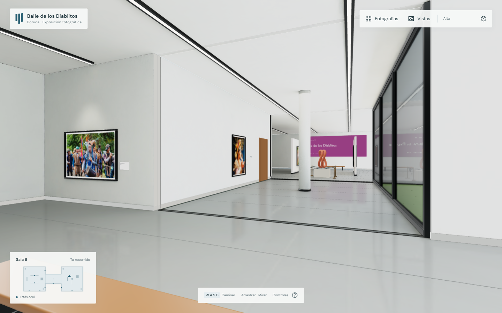
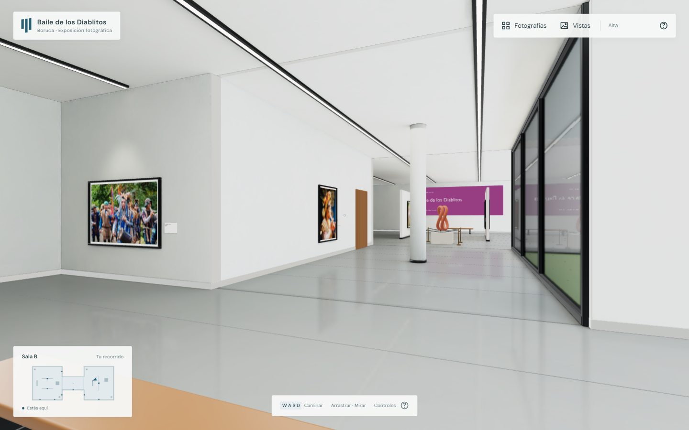

# Rendimiento y corrección de esquinas

Validación local del 7 de octubre de 2026. Comparación entre la compilación anterior de `main` (`b472ed3`) y esta optimización, en el mismo navegador y equipo, con calidad alta, viewport de 1440 × 901 y densidad de píxeles aproximadamente 1. La pestaña se mantuvo visible y enfocada; las primeras mediciones de una pestaña limitada por el navegador a 1 FPS se descartaron.

| Prueba | Antes | Después |
| --- | ---: | ---: |
| Giro continuo, muestra de 3 segundos | 60,46 FPS | 60,02 FPS |
| Percentil 95 del intervalo entre fotogramas durante el giro | 16,8 ms | 16,8 ms |
| Llamadas WebGL de dibujo durante 3 segundos en reposo | 47 965 | 0 |
| Manejo sincrónico de una ráfaga de 600 eventos de ratón | 207,9 ms | 3,4 ms |

La última fila mide el tiempo de los manejadores de eventos: la nueva versión agrupa la selección para resolverla una vez en el siguiente fotograma. No representa 600 selecciones completas realizadas en 3,4 ms. El refresco de aproximadamente 60 Hz ya limitaba el rendimiento anterior; estas cifras muestran que se conserva la cadencia al girar mientras se elimina trabajo en reposo y durante ráfagas de entrada. No son una garantía para todos los dispositivos.

## Cambios

- Renderizado a demanda, con continuación durante desplazamiento, giro, transiciones y finalización de las capturas de reflejos. Reanudación al cambiar tamaño o volver a una pestaña visible.
- Eventos del ratón agrupados por fotograma; las fichas del cursor solo cambian cuando cambia la fotografía seleccionada.
- Índice de cajas estáticas que descarta objetos fuera del rayo y conserva la intersección exacta de triángulos, el orden de impactos y las paredes que ocultan fotografías. También se utiliza para las nueve comprobaciones del enfoque.
- Transformaciones estáticas calculadas una vez. Comparaciones de matrices y memoria de trabajo reutilizada para los reflejos. No se capturan planos cuyas superficies estén completamente fuera del frustum.
- Calidad alta por defecto, sin ajuste automático hacia abajo. Se conservan antialiasing, máximo DPR de 1,5, geometría, imágenes, materiales, sombras de 2048, captura de piso de 1024 y vidrio de 768, filtrado y frecuencia de actualización. La calidad reducida permanece como opción explícitamente manual.
- Corrección de las esquinas negras: el anterior `polygonOffsetFactor` positivo desplazaba caras según su inclinación respecto de la cámara y dejaba los biseles por delante. Se reemplazó por prioridad constante pequeña hacia la cámara (`factor = 0`, unidades de −1 a −3). Conserva materiales y geometría y evita las franjas gruesas que aparecían al mirar de lado.

## Comprobaciones

- 35 pruebas pasan: navegación, datos, cámara, reflejos, selección acelerada, agrupación de eventos, receptor Window del planificador y regresión del sesgo de profundidad.
- TypeScript y compilación de producción correctos.
- Las 12 fotografías cargan y tienen vista de enfoque despejada, sin recurrir a la ficha alternativa. Se verificaron arrastre, giro, redimensionamiento durante el enfoque y las seis vistas.
- Antes de la corrección de esquinas, la comparación de la región central de la vista inicial entre ambas versiones tuvo diferencia máxima y media de 0. El regreso tras enfocar y cerrar una fotografía también tuvo diferencia de 0. La corrección posterior cambia deliberadamente los bordes defectuosos.
- Reproducción de la esquina de la sala B desde `(12, 1,65, −2)`, orientación 1,95 radianes, y 40 posiciones/orientaciones sucesivas. Las capturas antes/después documentan la eliminación de las franjas gruesas en pared y piso. Las muestras de vecindades de 5 × 5 píxeles alrededor de cuatro esquinas acumularon 263 píxeles oscuros antes y 20 después; este muestreo incluye también elementos cercanos y no pretende certificar todo el recorrido.
- Las fotografías, el GLB y el Blender editable no se modificaron ni recomprimieron.

Corrección posterior de carga: el planificador ahora llama a `window.requestAnimationFrame(callback)` y conserva el receptor requerido por la API nativa. Guardar la función como método del planificador producía una excepción de Window en navegadores sin instrumentación. La instrumentación de las mediciones anteriores sustituía temporalmente esa función y ocultó el fallo. Se añadió una regresión del receptor y se comprobó la compilación de producción en una pestaña nueva, con `requestAnimationFrame` nativo, sin errores de página: carga, entrada, giro, enfoque y regreso al recorrido.

Antes:

Después:

Referencias técnicas: [renderizado a demanda](https://threejs.org/manual/pages/rendering-on-demand.html), [transformaciones de matrices](https://threejs.org/manual/pages/matrix-transformations.html) y [compilación de shaders](https://threejs.org/docs/pages/WebGLRenderer.html). La implementación usa las API comprobadas en Three.js 0.170.0, instalado en el proyecto.
